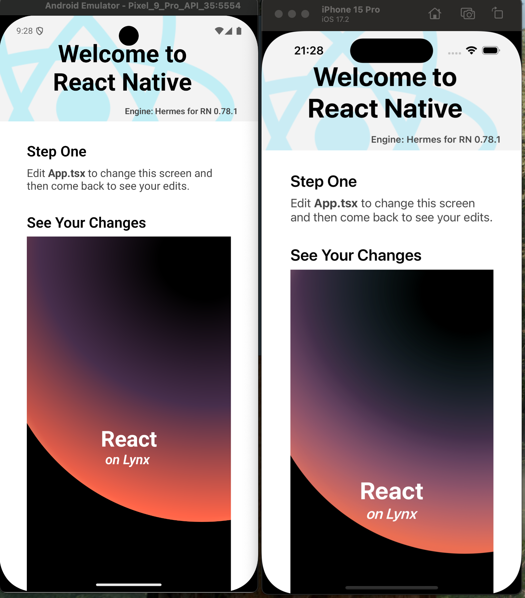

# React Native Render Lynx
[](https://www.npmjs.com/package/react-native-render-lynx)
[](LICENSE)
[](https://github.com/dcangulo/react-native-render-lynx/pulls)

Render a LynxJS bundle in your React Native application.

> [!WARNING]
> This library was created out of curiosity to explore LynxJS and see how it could be integrated with React Native. It was a weekend project and is purely a proof of concept. While it works, there may be gotchas or edge cases that I haven't encountered. Use at your own discretion. Contributions are welcome, but please be aware that responses to issues and pull requests may be limited.

## Known Issue
LynxJS bundles with images won't work with Android. This is because React Native is shipped with `fresco:3.6.0` by default, while LynxJS depends on `fresco:2.3.0`. Using either version crashes the app. See: https://github.com/lynx-family/lynx/issues/410

## Installation
### 1. Install the package
```bash
yarn add react-native-render-lynx
npx pod-install
```

### 2. Post-install steps
<details>
<summary><strong>Expo Prebuild</strong></summary>
In your <code>app.config.js</code>:

```diff
{
  // ...
  plugins: [
    // ...
+   'react-native-render-lynx',
  ],
  // ...
}
```
</details>

<details>
<summary><strong>iOS Template Changes</strong></summary>
In your <code>ios/Podfile</code>:

```diff
post_install do |installer|
  # ...

+ installer.pods_project.targets.each do |target|
+   if target.name == 'Lynx'
+     target.build_configurations.each do |config|
+       config.build_settings['CLANG_CXX_LANGUAGE_STANDARD'] = 'gnu++17'
+       config.build_settings['IPHONEOS_DEPLOYMENT_TARGET'] = '12.0'
+     end
+   end
+ end
end
```
> :bulb: You need to re-run `npx pod-install`.
</details>

<details>
<summary><strong>Android Template Changes</strong></summary>
In your <code>android/app/src/main/java/<your package name>/MainApplication.kt</code>:

```diff
+ import com.renderlynx.LynxInitializer

class MainApplication : Application(), ReactApplication {
  // ...
  override fun onCreate() {
    super.onCreate()
+   val initializer = LynxInitializer()
+   initializer.initLynxService(applicationContext)
+   initializer.initLynxEnv(this)
    SoLoader.init(this, OpenSourceMergedSoMapping)
    // ...
  }

  // ...
}
```
</details>

## Usage
```jsx
import { View, StyleSheet, Platform } from 'react-native';
import RenderLynxView from 'react-native-render-lynx';

export default function App() {
  // const bundleUrl = 'http://192.168.68.50:3001/main.lynx.bundle?fullscreen=true';
  const bundleUrl = Platform.select({ android: 'noimage.lynx.bundle', default: 'main.lynx.bundle' });

  return (
    <View style={styles.container}>
      <RenderLynxView style={styles.viewStyle} bundleUrl={bundleUrl} />
    </View>
  );
}

const styles = StyleSheet.create({
  container: {
    flex: 1,
    padding: 50,
  },
  viewStyle: {
    height: 700,
    width: 300,
    marginTop: 32,
  },
});
```

### Using a Remote Bundle
Run `yarn dev`, `npm run dev`, or `rspeedy dev` in your LynxJS project.

```jsx
<RenderLynxView bundleUrl='http://192.168.68.50:3001/main.lynx.bundle?fullscreen=true' />
```

### Importing Bundle in Expo Prebuild
* To follow.

### Importing Bundle in iOS
1. Open your project on Xcode.
2. In the target settings of your project, select the target.
3. Select the Build Phases tab.
4. In the Copy Bundle Resources section, click the add button (+) to add your bundle file `main.lynx.bundle`.
> :bulb: https://developer.apple.com/documentation/xcode/customizing-the-build-phases-of-a-target#View-and-add-build-phases-to-a-target

```jsx
<RenderLynxView bundleUrl='main.lynx.bundle' />
```

### Importing Bundle in Android
Put your bundle file `main.lynx.bundle` in `android/app/src/main/assets` directory.
> :bulb: Create the directory if it does not exist.

```jsx
<RenderLynxView bundleUrl='noimage.lynx.bundle' />
```

### Creating a Bundle
You can start creating LynxJS bundles by following the official documentation: https://lynxjs.org/guide/start/quick-start.html

## Screenshots


## Changelogs
See [CHANGELOGS.md](CHANGELOGS.md)

## License
Copyright © 2025 David Angulo, released under the MIT license, see [LICENSE](LICENSE).

---

Made with [create-react-native-library](https://github.com/callstack/react-native-builder-bob)
